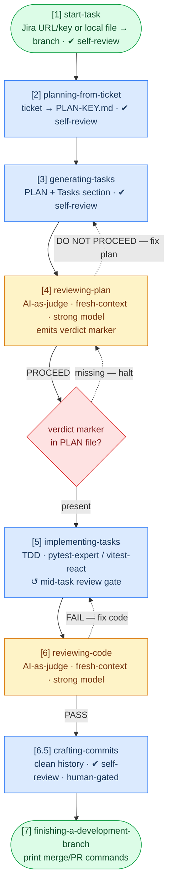

# start-task Skill Implementation Plan

> **For agentic workers:** REQUIRED SUB-SKILL: Use superpowers:subagent-driven-development (recommended) or superpowers:executing-plans to implement this plan task-by-task. Steps use checkbox (`- [ ]`) syntax for tracking.

**Goal:** Add a `start-task` skill as the single pipeline entry point that fetches a Jira ticket (or reads a local file) and sets up a git branch (or worktree), replacing the current two-step `using-git-worktrees` + `fetching-tickets` flow.

**Architecture:** `start-task` is a thin orchestrator — it detects input type, delegates to `fetching-tickets` for Jira fetches, constructs a branch name, and creates a plain branch (or invokes `using-git-worktrees` when `--worktree` is passed). `fetching-tickets` becomes an internal sub-skill, no longer user-facing.

**Tech Stack:** Pure Markdown skill files. No code, no build system. Changes are to SKILL.md files and README.md.

---

## Task T1: Create `skills/start-task/SKILL.md`

**Files:**
- Create: `skills/start-task/SKILL.md`

- [ ] **Step 1: Create the skill directory and SKILL.md**

Create `skills/start-task/SKILL.md` with the following exact content:

```markdown
---
name: start-task
description: Use when the user wants to start a new task — accepts a Jira ticket URL, Jira key, or local ticket file path. Sets up a git branch and fetches the ticket. Triggers on "start task", "begin PROJ-42", "set up a branch for", "start working on". Do not trigger automatically.
model: inherit
color: cyan
---

# Start Task

Bootstrap a new task: fetch the ticket (if remote) and set up a clean branch — so you can jump straight into planning.

**Next step:** once the branch is ready, run `planning-from-ticket` on the ticket file.

## Where You Sit in the Pipeline

```
[1] start-task          ← YOU ARE HERE
[2] planning-from-ticket
[3] generating-tasks
[4] reviewing-plan
[5] implementing-tasks
[6] reviewing-code
[6.5] crafting-commits
[7] finishing-a-development-branch
```

## Input Detection

Accepts one required argument. Detect the source type:

| Input | Example | Action |
|---|---|---|
| Jira URL | `https://site.atlassian.net/browse/PROJ-42` | Extract key → invoke `fetching-tickets` |
| Jira key | `PROJ-42` | Invoke `fetching-tickets` |
| Local file | `./tickets/PROJ-42/PROJ-42.md` | Read file directly — no fetch |
| Anything else | `"add password reset"` | Reject — tell developer to provide a Jira URL, key, or local file path |

**Confirm before fetching:**
> *"Looks like PROJ-42 — should I fetch it and set up a branch?"*

Ad-hoc descriptions are rejected. `start-task` is task onboarding, not planning. No ticket → use `planning-from-ticket` directly with a spec file.

**REQUIRED SUB-SKILL:** When input is a Jira URL or key, invoke `fetching-tickets` to perform the fetch. Do not re-implement Jira fetch logic here.

## Workspace Setup

After ticket is confirmed and fetched (or read from disk):

### 1. Detect base branch

```bash
git remote show origin | grep 'HEAD branch' | awk '{print $NF}'
```

Ask the developer to confirm:
> *"Base branch detected as `develop`. Branch off this, or a different one?"*

### 2. Check for dirty working tree

```bash
git status --porcelain
```

If output is non-empty, ask before proceeding:
> *"You have uncommitted changes. Should I stash them, or would you prefer to handle this first?"*

Never stash silently.

### 3. Sync

```bash
git fetch origin
git checkout <base-branch>
git pull origin <base-branch>
```

### 4. Construct branch name

Pattern: `{type}/{ticket-key}/{slug}`

Examples:
- `feat/PROJ-42/add-user-auth`
- `fix/PROJ-55/null-pointer-payment`

**Derive type from Jira issue type:**

| Jira issue type | Branch type |
|---|---|
| Bug | `fix` |
| Story, Task, Feature | `feat` |
| Sub-task | Inherit parent type, or ask |
| Anything else | Ask developer |

**Derive slug:** 2-4 word kebab-case from ticket title. Drop articles (a, an, the), prepositions (for, with, via), helper verbs (is, be, has). Keep the core action and object.

**Confirm with developer before creating:**
> *"I'll create branch `feat/PROJ-42/add-user-auth` based off `develop` — sound good?"*

### 5. Create branch (default)

```bash
git checkout -b feat/PROJ-42/add-user-auth
```

**No push.** Branch stays local until the developer's first commit. `finishing-a-development-branch` handles push and PR.

### `--worktree` flag

```
/start-task PROJ-42 --worktree
```

When `--worktree` is passed, invoke `superpowers:using-git-worktrees` instead of creating a plain branch. Pass the constructed branch name to it. All worktree logic is owned by that skill — do not re-implement it here.

Use `--worktree` when:
- You have in-flight work on another branch and don't want to switch
- You're dispatching an agent to implement this task in parallel with another
- You want full isolation between concurrent tasks

**Branch vs worktree:** Sequential work → plain branch. Parallel work → worktree.

## Handoff

Print a brief summary and point to the next step:

```
Branch `feat/PROJ-42/add-user-auth` ready (based off `develop`).
Ticket saved to `tickets/PROJ-42/PROJ-42.md`.

Next: /planning-from-ticket tickets/PROJ-42/PROJ-42.md
```

No push commands. No extra reminders.

## You Must NOT

- Fetch a ticket without confirming with the developer first
- Stash or discard uncommitted changes without explicit confirmation
- Push the branch — that is `finishing-a-development-branch`'s job
- Accept ad-hoc descriptions — reject and redirect to `planning-from-ticket`
- Re-implement Jira fetch logic — delegate to `fetching-tickets`
- Re-implement worktree logic — delegate to `superpowers:using-git-worktrees`
- Trigger automatically — this skill is opt-in only
```

- [ ] **Step 2: Verify the file was created**

```bash
cat skills/start-task/SKILL.md
```

Expected: file prints without error, frontmatter at top, all sections present.

- [ ] **Step 3: Verify symlink works after install**

```bash
./install.sh --scope=user --tool=claude
ls -la ~/.claude/skills/ | grep start-task
```

Expected: `start-task -> .../agentic-skills/skills/start-task`

- [ ] **Step 4: Commit**

```bash
git add skills/start-task/SKILL.md
git commit -m "feat: add start-task skill as unified pipeline entry point"
```

---

## Task T2: Update `fetching-tickets` description

**Files:**
- Modify: `skills/fetching-tickets/SKILL.md` (frontmatter description only)

- [ ] **Step 1: Read current frontmatter**

```bash
head -5 skills/fetching-tickets/SKILL.md
```

Current description:
```
Use when the user provides a Jira ticket URL or key and wants it saved as a local markdown file with all assets (images, attachments). Triggers on phrases like "pull this ticket", "save ticket to markdown", "download ticket", "create a local copy of this Jira issue".
```

- [ ] **Step 2: Update the description**

Replace the `description` line in the frontmatter with:

```
description: Use when fetching a Jira ticket to disk is needed as a standalone operation. Normally invoked by start-task — use this directly only if you already have a branch set up and only need the ticket file. Triggers on "pull this ticket", "save ticket to markdown", "download ticket".
```

- [ ] **Step 3: Verify**

```bash
head -5 skills/fetching-tickets/SKILL.md
```

Expected: updated description visible in frontmatter.

- [ ] **Step 4: Commit**

```bash
git add skills/fetching-tickets/SKILL.md
git commit -m "docs: mark fetching-tickets as sub-skill invoked by start-task"
```

---

## Task T3: Fix `implementing-tasks` worktree step

**Files:**
- Modify: `skills/implementing-tasks/SKILL.md` line 126

- [ ] **Step 1: Read the current line**

```bash
grep -n "Optional.*Workspace\|using-git-worktrees" skills/implementing-tasks/SKILL.md
```

Current text (line 126):
```
0. **(Optional) Workspace isolation** — if the developer wants an isolated workspace, invoke `superpowers:using-git-worktrees` before writing the first test.
```

- [ ] **Step 2: Replace with explicit rule**

Replace line 126 with:

```
0. **Workspace isolation** — In auto mode, always invoke `superpowers:using-git-worktrees` before writing the first test — agents run unattended and isolation is non-negotiable. In collaborative mode, `start-task` will have already set up the branch or worktree; skip this step unless the developer explicitly asks for a worktree.
```

- [ ] **Step 3: Verify**

```bash
grep -n "Workspace isolation" skills/implementing-tasks/SKILL.md
```

Expected: updated line with no "Optional" qualifier.

- [ ] **Step 4: Commit**

```bash
git add skills/implementing-tasks/SKILL.md
git commit -m "fix: make worktree mandatory in auto mode for implementing-tasks"
```

---

## Task T4: Update README pipeline diagram and docs

**Files:**
- Modify: `README.md`

This task has three independent edits to README.md — apply them in sequence.

### Edit A: Mermaid diagram

- [ ] **Step 1: Replace the two-node diagram header with one `start-task` node**

Current (lines 20–21 and 31):
```
    W(["[0] using-git-worktrees\nisolate workspace"]):::sp
    FT["[1] fetching-tickets\nJira → TICKET-KEY.md · ✔ self-review"]:::pipe
    ...
    W --> FT --> PFT --> GT --> RP
```

Replace with:
```
    ST(["[1] start-task\nJira URL/key or local file → branch · ✔ self-review"]):::sp
    ...
    ST --> PFT --> GT --> RP
```

Full updated diagram block:

```

```

### Edit B: Option B quickstart block

- [ ] **Step 2: Replace `fetching-tickets` step in the Option B quickstart**

Current (line 109):
```bash
/fetching-tickets https://yoursite.atlassian.net/browse/PROJ-123
```

Replace with:
```bash
/start-task https://yoursite.atlassian.net/browse/PROJ-123
```

### Edit C: Skills Reference section

- [ ] **Step 3: Replace the `fetching-tickets` reference entry with `start-task`**

Current `### fetching-tickets` block (lines 141–155):
```markdown
### `fetching-tickets`

Pulls a Jira ticket to a local markdown file with all images downloaded.

| | |
|---|---|
| **Input** | Jira ticket URL or key (`PROJ-123`) |
| **Output** | `tickets/PROJ-123/PROJ-123.md` + `tickets/PROJ-123/images/` |
| **Auto mode** | Supported, fetches without pausing |
| **Requires** | `JIRA_EMAIL` and `JIRA_API_TOKEN` env vars |

```bash
/fetching-tickets https://yoursite.atlassian.net/browse/PROJ-123
/fetching-tickets PROJ-123
```
```

Replace with:
```markdown
### `start-task`

Fetches a Jira ticket (or reads a local file) and sets up a git branch — the single entry point for starting any new task.

| | |
|---|---|
| **Input** | Jira ticket URL, Jira key (`PROJ-123`), or local file path |
| **Output** | `tickets/PROJ-123/PROJ-123.md` + branch `{type}/PROJ-123/{slug}` |
| **Flags** | `--worktree` — create a git worktree instead of a plain branch |
| **Requires** | `JIRA_EMAIL` and `JIRA_API_TOKEN` env vars (for Jira inputs) |

```bash
/start-task https://yoursite.atlassian.net/browse/PROJ-123
/start-task PROJ-123
/start-task PROJ-123 --worktree
/start-task ./tickets/PROJ-123/PROJ-123.md
```
```

### Edit D: Auto mode explanation (line 293)

- [ ] **Step 4: Update the `auto` chaining note**

Current (line 293):
```
**`auto` does not chain skills.** Even in auto mode, each skill is a discrete command. `/fetching-tickets auto` fetches the ticket and stops. You decide when to invoke the next step.
```

Replace with:
```
**`auto` does not chain skills.** Even in auto mode, each skill is a discrete command. `/start-task PROJ-123` fetches the ticket, sets up the branch, and stops. You decide when to invoke the next step.
```

### Edit E: Model tiers table (line 337)

- [ ] **Step 5: Update model tiers table**

Current:
```
| `fetching-tickets`, `generating-tasks` | Mechanical / extraction | Any capable model |
```

Replace with:
```
| `start-task`, `generating-tasks` | Mechanical / extraction | Any capable model |
```

- [ ] **Step 6: Verify README renders correctly**

```bash
grep -n "start-task\|fetching-tickets" README.md
```

Expected: `start-task` appears in diagram, quickstart, skills reference, auto-mode note, and model tiers. `fetching-tickets` should not appear as a user-facing command anywhere.

- [ ] **Step 7: Commit**

```bash
git add README.md
git commit -m "docs: replace fetching-tickets with start-task in pipeline diagram and docs"
```

---

# Tasks

- [ ] T1: Create `skills/start-task/SKILL.md`
- [ ] T2: Update `fetching-tickets` description
- [ ] T3: Fix `implementing-tasks` worktree step
- [ ] T4: Update README pipeline diagram and docs
