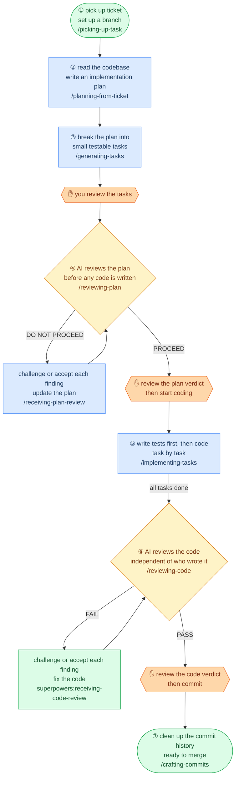

# Spec: README Update — Design Principles + Reader-Centric Restructure

**Date:** 2026-06-17  
**Branch:** refine-readme  
**Scope:** README.md only — no skill logic changes

---

## Problem

The current README has accurate content but is organized for someone who already understands the pipeline. A new engineer reads the flowchart, finds no explanation of *why* it's built this way, skips to the skills reference, and has no mental model to hang the details on. The recent human review gate additions (REVIEW-LOG stamps, preflight checks) are also not reflected in the diagram or the skills reference tables.

---

## Goals

1. Make the README work for both audiences: new engineer (first impression) and existing user (reference).
2. Surface design principles early so the flowchart is immediately legible.
3. Make the Mermaid diagram self-explanatory — clear plain-English node labels, a legend, and visible gate annotations so no prose walkthrough is needed.
4. Update the diagram to show human review gates as first-class pipeline nodes.
5. Update the skills reference to document what each skill checks and writes.

---

## Non-goals

- No changes to any skill logic or SKILL.md files.
- No new sections beyond what is described here.
- No changes to installation or quickstart commands.

---

## Structure (new order)

```
1. Title + tagline + quote          (unchanged)
2. Agentic Coding Workflow          (Mermaid diagram — updated with human gate nodes + legend)
3. Design Principles                (NEW)
4. Use Cases                        (unchanged, moved before installation)
5. Installation                     (unchanged)
6. Quickstart                       (unchanged)
7. Skills Reference                 (updated: Gates row per skill)
8. Collaborative vs auto mode       (unchanged)
9. Composes with superpowers        (consolidated block)
   → Review tiers
   → Superpowers sub-skills
   → Recommended model tiers
10. Book Skills                     (unchanged)
```

---

## Section: Updated Flowchart

### New node type

Add a fourth node class for human review gates:

```
classDef gate fill:#fed7aa,stroke:#ea580c,color:#7c2d12
```

Shape: hexagon (`{{...}}` in Mermaid flowchart syntax).

### Gate nodes and their positions

| Gate node label | Sits between |
|---|---|
| `human-gate: generating-tasks stamp` | `generating-tasks` → `reviewing-plan` |
| `human-gate: reviewing-plan stamp` | `reviewing-plan` PROCEED → `implementing-tasks` |
| `human-gate: reviewing-code stamp` | `reviewing-code` PASS → `crafting-commits` |

Note: the mid-task review inside `implementing-tasks` is handled by `superpowers:requesting-code-review` (an AI sub-skill) — not a human gate. It does not appear in the diagram.

### Design principles for the diagram

The diagram should be self-explanatory without any surrounding prose. To achieve this:

1. **Node labels use plain English** — describe what the step does, not just its name. Example: `"fetch ticket, create branch"` not just `"picking-up-task"`.
2. **Edge labels explain transitions** — `PROCEED`, `DO NOT PROCEED`, `PASS`, `FAIL`, `after each task`, `all tasks done`.
3. **Gate labels are action-oriented** — `"✋ you review & approve"` rather than `"human gate: stamp"`.

### Full updated Mermaid source



---

## Section: Design Principles (new)

Position: immediately after the flowchart, before Use Cases.

Six principles:

1. **Review early, review often.** A flaw surfaced before coding costs nothing. The same flaw after five tasks can invalidate all five.
2. **Two review tiers, split by role.** Self-review handles mechanical checks (cheap, always runs). AI-as-judge handles subjective quality calls (fresh context, targeted). Neither replaces the other.
3. **Human gates are not optional.** Every AI verdict requires a human `APPROVE` stamp in `REVIEW-LOG.md` before the next step starts. The log is the audit trail.
4. **No self-preference bias.** Judge subagents run in a fresh context with no access to the producing session's framing or justifications.
5. **Auto mode removes pauses, not safeguards.** Git boundaries and judge halts are invariants in both modes. `auto` is a workflow speed setting, not a bypass.
6. **Enter at any step.** Every skill is independently usable. The pipeline is resumable, not monolithic — start wherever the upstream artifact already exists.

---

## Section: Skills Reference updates

Add a **Gates** row to the reference table for each skill that participates in the REVIEW-LOG protocol.

| Skill | Checks on entry | Writes on exit |
|---|---|---|
| `reviewing-plan` | `generating-tasks` stamp in `REVIEW-LOG.md` | `reviewing-plan` stamp after human approval |
| `implementing-tasks` | `reviewing-plan` stamp in `REVIEW-LOG.md` | — (no human gate; AI self-reviews between tasks) |
| `reviewing-code` | — | `reviewing-code` stamp after human approval |
| `crafting-commits` | `reviewing-code` stamp in `REVIEW-LOG.md` | — (terminal step) |

In each skill's reference table block, add two rows:

```
| **Checks** | `<upstream-skill>` stamp in `REVIEW-LOG.md` |
| **Writes** | `<this-skill>` stamp after human approval |
```

`picking-up-task`, `planning-from-ticket`, and `generating-tasks` do not check an upstream gate but `generating-tasks` writes the first stamp — note this in its table.

---

## Section: "Composes with superpowers" consolidation

No content changes. Move the entire block (review tiers table, superpowers sub-skills table, recommended model tiers table) to sit immediately after the Skills Reference section, before Book Skills. Currently it floats mid-doc between Skills Reference and Book Skills — this just makes the positioning explicit.

---

## Out of scope

- The `REVIEW-LOG.md` format spec (already documented in skill files).
- The `receiving-plan-review` and `superpowers:receiving-code-review` skills reference entries (no changes needed).
- `picking-up-task` and `planning-from-ticket` reference tables (no gate rows needed).
